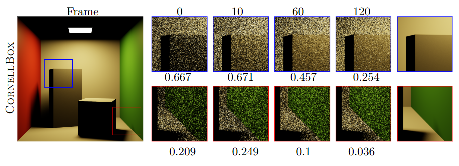
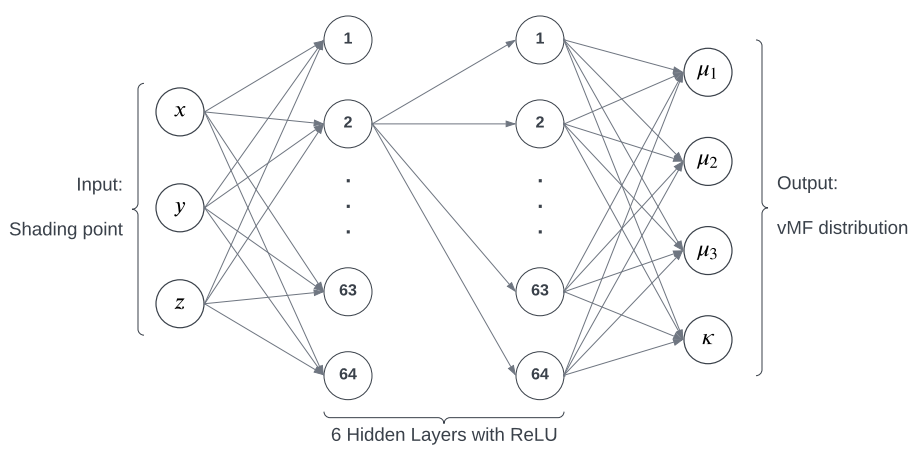
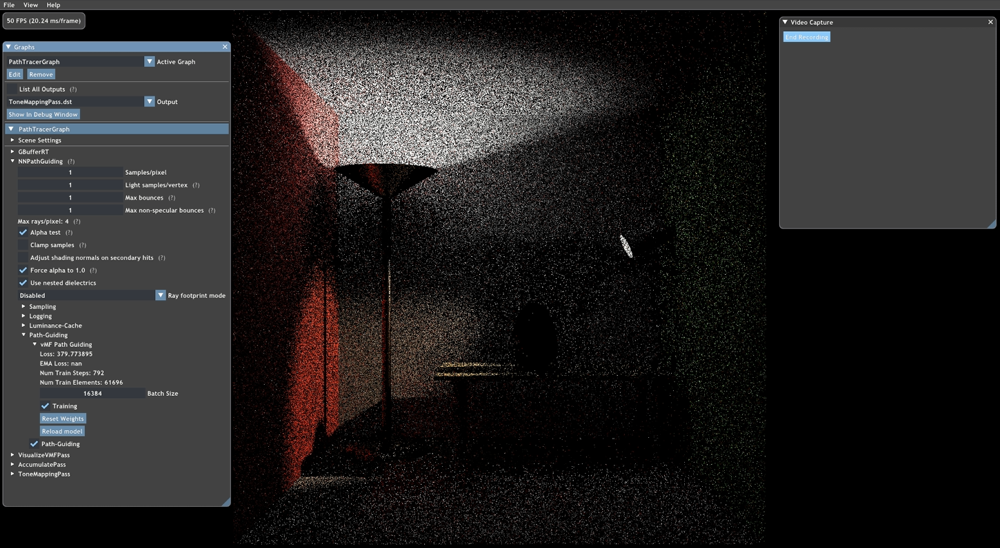
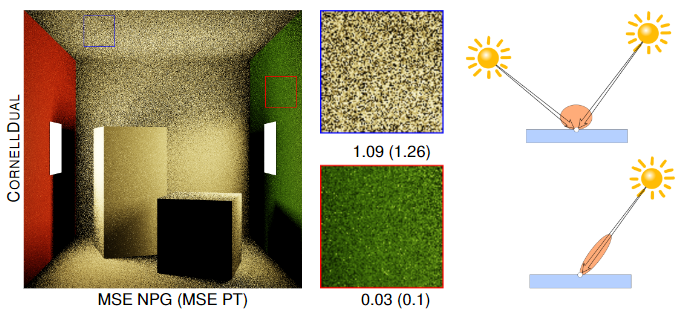

  
  

# Real Time Neural Path Guiding
> This is the implementation of my bachelor thesis at the Department of Informatics, Computer Graphics Group at KIT.

## Abstract of my thesis
With modern GPUs supporting hardware-accelerated ray tracing, we do have the ability to generate path-traced images in realtime. Due to the time constraint, the amount of rays per pixel and frame is limited to a few. This leads to high variance in the Monte Carlo estimate for the Radiative Transfer Equation. In this work we discuss state of the art techniques for reducing variance of direct and indirect illumination with the main focus on rendering dynamic scenes in realtime.

We propose a novel path guiding technique to reduce variance by learning an estimate of the 5D incident radiance field within the scene. A multilayer perceptron is used to partition the spatial domain and a parameterized model is fitted to approximate the directional domain of this radiance field. During rendering this estimated radiance field can be used to guide the paths towards directions of high incident radiance. As a parameterized model we examine the use of von Mises-Fisher distributions and derive a loss function to train the multilayer perceptron in online fashion. We evaluate different strategies to collect training data and test our approach on static and dynamic scenes.

## Concept
In 2021 Muller et al. proposed a realtime radiance caching technique which uses a small multilayer perceptron to cache radiance. To see their paper click [here](https://research.nvidia.com/publication/2021-06_real-time-neural-radiance-caching-path-tracing). Their neural network implementation is fast enough to be trained and queried every single frame. In my thesis I use the same neural network approach, however instead of caching the radiance at a point in the scene, the multilayer perceptron learns the distribution of incident radiance at this point. This information can be used to guide future rays in more promissing directions and thus reduce noice in the final render. Over the course of roughly 60 frames, the multilayer perceptron is able to learn an approximation of the radiance distibution in a simple scenes and thus reduce the noise produced by the path tracer.

Ash shown here, the noise and Mean Squared Error reduce over the course of multiple frames.

## Framework and Libraries
- Falcor 4.4
- Tiny CUDA Neural Networks

## Prerequisites
- Windows 10 version 20H2 (October 2020 Update) or newer
- Visual Studio 2019
- [Windows 10 SDK (10.0.19041.0) for Windows 10, version 2004](https://developer.microsoft.com/en-us/windows/downloads/windows-10-sdk/)
- A GPU which supports DirectX Raytracing, such as the NVIDIA Titan V or GeForce RTX (make sure you have the latest driver). I used an RTX 3070.
- NVAPI (see below)
- CUDA 11.8 (see below)

1.  After cloning the repository, head over to https://developer.nvidia.com/nvapi and download the latest version of NVAPI (this build is tested against version R440).
    Extract the content of the zip file into `Source/Externals/.packman/` and rename `R470-developer` to `nvapi`.
    Finally, set `_ENABLE_NVAPI` to `1` in `Source/Falcor/Core/FalcorConfig.h`

2.  Download and run the CUDA Toolkit installer from [here](https://developer.nvidia.com/cuda-11.8-download-archive). Navigate to the location the CUDA Toolkit was installed to (`C:\Program Files\NVIDIA GPU Computing Tools\CUDA` by default). Copy the `v.11.8` folder into `Source/Externals/.packman` and rename it `cuda`.

> NOTE: This project in it's current state lacks a build system and thus, changing the cuda version or windows sdk version requires manual modification of the visual studio .sln!

## Running the NPG_example

After installing all dependencies you can build Falcor and the NNPathGuiding render pass. Make sure to build Mogwai as well. Execute Mogwai and load the NPG_example.py script. This will start the PathGuidingNN render pass and load the CornellBox scene. To start training, open the NNPathGuiding>PathGuiding>vMF-PathGuiding tab and use the Training checkbox to start and stop the training. The path tracer starts collecting samples of light for randomly chosen points in the scene an feed them to the multilayer perceptron. This way the incident radiance is learned.

To use the multilayer perceptron for guiding the rays during rendering, use the Path-Guiding checkbox. You can restart the training by reloading the model and see observe the learining progress of the multi layer perceptron in real time.

You can navigate to `Source/RenderPasses/NNPathGuiding/` and edit the network configuration in `network_config.json`.

## Limitations and Future Work
In the current state the implementation suffers from numerical instability which causes flickering and in some cases introduces NaNs in the calculations. This is most likely due to the noisy samples used for training. As shown in my thesis, changes to the loss function reduced these issues. However, there is room for improvement, so further research is needed.

The use of a single-lobe von-Mises-Fisher distribution is not sufficient for representing more complex lighting. The use of multiple lobes or other distributions could improve the quality of the approximation sicnificantly. As shown below, in spots that are illuminated from to opposing light sources, the vMF approximates the incident radiance poorly. This results in a noisy output in those areas.

In the current state, the project lacks a build system. Thus updating to newer versions of CUDA or Visual Studio requires a lot of manual work. The integration of a build system like cmake is mandatory for further research with this codebase.

## Acknowledgement
The codebase for my thesis was kindly provided by Egor Feklisov and Dmitrii Klepikov from Moscow State University. Their work got me setup  for my research quickly and allowed many interesting experiments.

Special thanks to Mikhail Dereviannykh and Dr. Johannes Schudeiske, who gave me this amazing opportunity and supported me with valuable advice during my research!

Check out their research at (https://www.mishok43.com/home) and (https://jo.dreggn.org/home/)!
